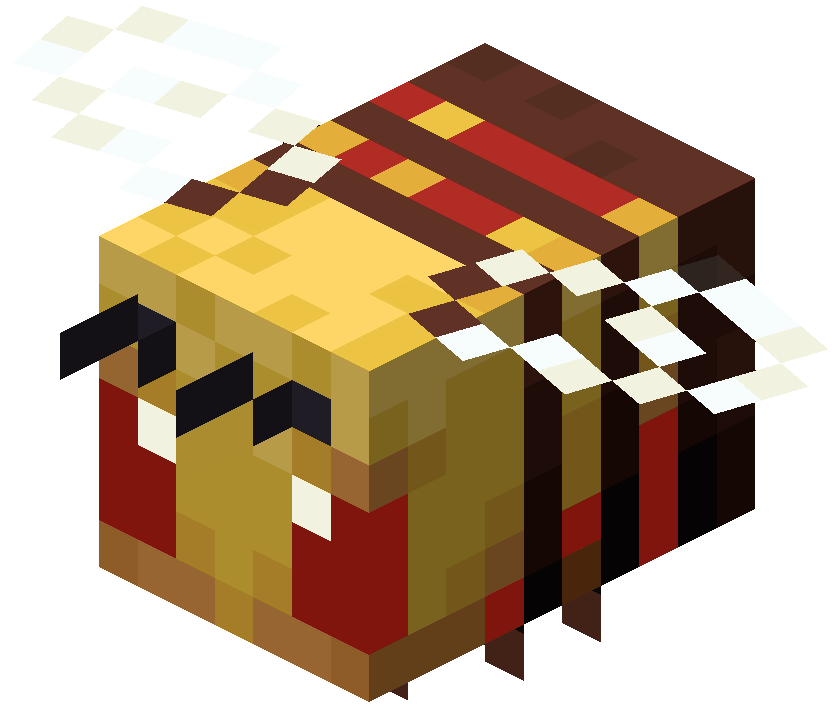

# Killer Bee Mod
_A Fabric mod for Minecraft_

This mod adds a brand-new kind of bee: the ***killer bee***.
It is just like a normal bee, except that it has red on its skin, has a bit more health, and deals much more damage.  

This bee also scales its poison level and duration depending on the difficulty:
- Easy: Poison I, for 2 seconds
- Normal: Poison II, for 12 seconds
- Hard: Poison III, for 20 seconds

The killer bee deals 7 HP (3.5 hearts) of damage, and has itself 16 HP.  
You can breed the killer bees together to get more, but you can also breed them with normal bees, in which case you have a 50% chance of getting a baby killer bee.

Just like a normal bee, it naturally generates in the nests that seldom appear on trees.
For each bee in a nest, there is a 25% chance it is a killer bee.

